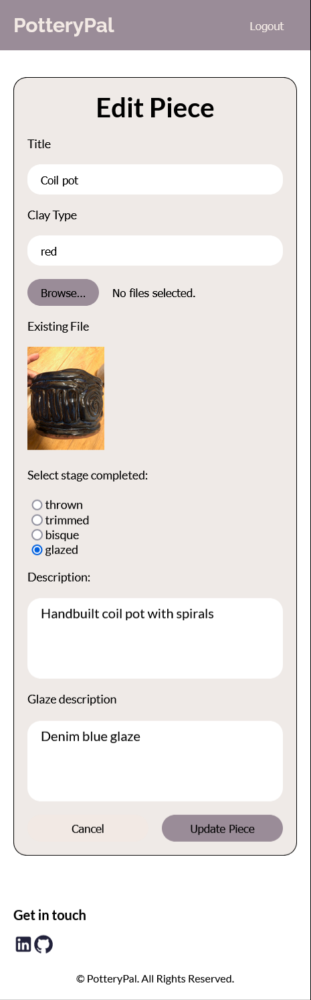

# Project Title
Pottery Pal

## Overview

Pottery Pal is a pottery project logging tool to help you remember your pieces as it moves through the different stages of pottery and the glazes you put on it.

### Problem

Have you ever looked at your pottery an ceramic pieces and couldn't recall what glaze combos you used? Do you have difficulty recollecting all your pieces as it moves through the different stages of making pottery? Then Pottery Pal is the tool for you. You can use it to log information of all your pottery pieces as you work on them and take picture along the different stages. This way you will always have areference on hand wether you need to find your pieces in the studio or if you need to refer back to how to made your older pieces. 

## Tech Stack

### Client
- HTML
- SCSS
- React.js
- Client libraries: 
    - react
    - react-router
    - axios
    - MUI


### Server
- Node.js
- Express
- Knex
- MySQL
- Multer

## Local Install

### Client Install
On your terminal, navigate to the client folder, run:
```
npm install
```
Set up a local .env file in the client folder with your localhost url with the following attribute
```
VITE_LOCALHOST=your_backend_local_host_url
```
then run the following code to start the client app:
```
npm run dev
```

### Server Install

Next, navigate to the server folder, and run:
```
npm install
```
Set up a .env file with the appropriate information, as specified below:
```
PORT=8080
DB_HOST=127.0.0.1
DB_NAME=your_db_name
DB_USER=your_database_user
DB_PASSWORD=your_database_password
```
then run, the following code to migrate and seed the sample data:
```
npm run migrate
npm run seed
npm start
```

## Implementation

### Sitemap

- Home Page
- Item Detail Page
- Edit Item Page
- Delete Item Modal
- Add New Item Page

## Screenshots

### Login Page


### Home Page


### Item Detail Page


### Edit Item Page



### Delete Item Modal


### Add New Item Page


### Data


### Endpoints

**GET /pieces**

- Get list of pottery pieces items and display the image and title of the piece.

Parameters: 

- none.

Response:
```
[
    {
        "piece_id": 2,
        "title": "Coil pot",
        "description": "Handbuilt coil pot with spirals",
        "clay_type": "red",
        "images": "coil-pot.jpg",
        "img_id": "2"
    },
    {
        "piece_id": 3,
        "title": "Slip Bowls",
        "description": "Wheel thrown bowls with white slip base and spiraled coloured slip on top.",
        "clay_type": "red",
        "images": "slip-swirl-trimmed.jpg",
        "img_id": "3"
    },
    ...
]
```

**GET /pieces/:id**

- Get details about a specific piece based on what item the user selects.

Parameters:
- id : piece id

Response:
```
{
    "piece_id": 2,
    "title": "Coil pot",
    "description": "Handbuilt coil pot with spirals",
    "clay_type": "red",
    "stage": "glazed",
    "glaze": "Denim blue glaze",
    "images": "coil-pot.jpg",
    "img_id": "2"
}
```

**POST /pieces/add**

- This allows for the user to add new pieces to their log.
- Surface-decoration field is not required.
- Glaze description only required once stage is recorded as glazed.

Parameters:
- id : piece id

Request body example (FormData):
```
title: Spiral bowls
clay_type: white
stage: bisque
description: Wheel thrown bowls with spiral blue and gray stain.
glaze: Transparent glaze. 
user_id: 1
images: (binary)
```

Response:
```
{
    "title": "Spiral bowls",
    "clay_type": "white",
    "stage": "bisque",
    "description": "Wheel thrown bowls with spiral blue and gray stain.",
    "glaze": "Transparent glaze. ",
    "user_id": "1"
}
```
- Response returns 400 if unsuccessful because of missing properties in the request body
- Response returns 201 if successful

**PATCH /pieces/:id**

- Allows for update of pottery pieces based on the id parameter.
- Surface-decoration field is not required.
- Glaze description only required once stage is recorded as glazed.
- id cannot be updated.

Parameters:
- id : piece id

Request body example(FormData):
```
title: Coil pot
clay_type: Red
stage: glazed
description: Hand built coil pot with spirals
glaze: Denim blue glaze
user_id: 1
piece_id: 2
images: [object Object]
```

Response:
```
{
    "piece_id": 2,
    "title": "Coil pot",
    "description": "Hand built coil pot with spirals",
    "clay_type": "Red",
    "stage": "glazed",
    "glaze": "Denim blue glaze",
    "images": "coil-pot.jpg"
}
```
- Response returns 404 if id is not found

- Response returns 200 if successful with the JSON object shown in response.

**DELETE /pieces/:id**

This allows for the deletion of a single pottery piece.

Parameters:
- id : piece id

Response:
- No response body
- Response returns 404 if pottery piece id is not found
- Response returns 204 if successfully deleted

## How to use PotteryPal:
- Navigate to homepage, to view a list of the entries for  sample user.
- Click on any entry to view the details of the piece.
- Click "Add Piece" button to go to the add page. Fill out the form with the relevant fields and click "Add Piece" to add data to the database. 
- To edit any entry click the edit icon on the home page or edit button on the item detail page. This redirects the user to the edit page, where the user can edit a form populated with the current values of the item. Click "Update Piece" to update the information.
-To delete any item click on the delete icon on the homepage or the delete button in the item detail page. This opens a modal for delete confirmation, and deletes the item when user clicks "Delete".


## Future implementations:
- Sign up and Log in feature
- Allow multi image upload
