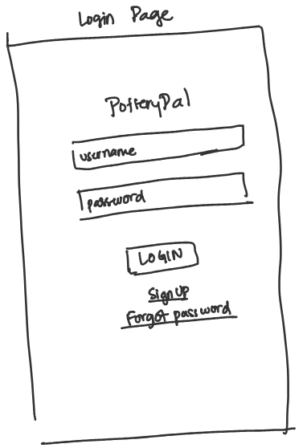
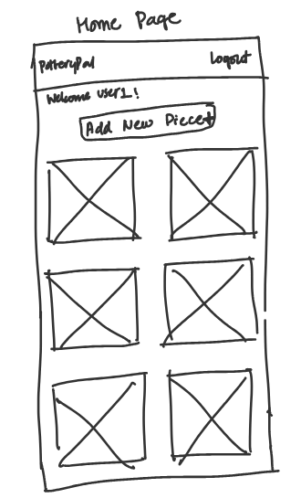
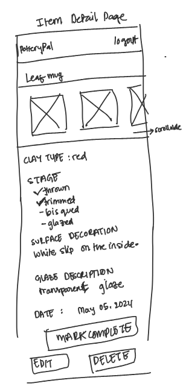
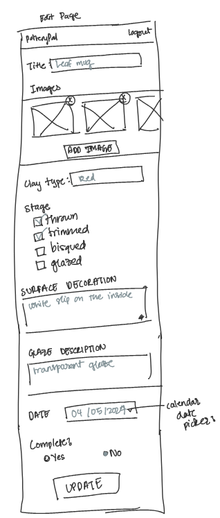
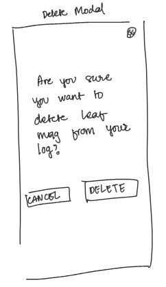
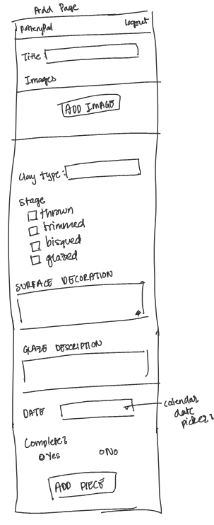
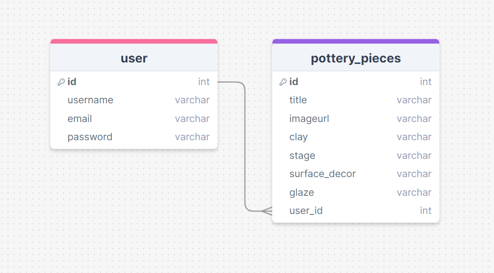

# Project Title
Pottery Pal

## Overview

Pottery Pal is a pottery project logging tool to help you remember your pieces as it moves through the different stages of pottery and the glazes you put on it.

### Problem

Have you ever looked at your pottery an ceramic pieces and couldn't recall what glaze combos you used? Do you have difficulty recollecting all your pieces as it moves through the different stages of making pottery? Then Pottery Pal is the tool for you. You can use it to log information of all your pottery pieces as you work on them and take picture along the different stages. This way you will always have areference on hand wether you need to find your pieces in the studio or if you need to refer back to how to made your older pieces. 

### User Profile

People who do pottery who :
- are looking to keep a visual record of their pieces as it moves through the different stages
- want a reference of the pieces they have made and are working on.
- want to note different aspects about their pieces (weight, measurements, clay type, glaze, pottery techniques, surfacec decorations)

### Features

- As a user I want to be able to Sign Up or Log In.
- As a logged in user, I want to be able to view a list of all my current and past projects.
- As a logged in user, I want to be able to Read the details of any project I select.
- As a logged in user, I want to be able to Edit the detials of any project I select.
- As a logged in user, I want to be able to Create new projects.
- As a logged in user, I want to be able to Delete any projects I select.

## Implementation

### Tech Stack

- React
- JavaScript
- MySQL
- Express
- Client libraries: 
    - react
    - react-router
    - axios
    - MUI
- Server libraries:
    - knex
    - express
    - JWT token for encrypting passwords
    
### APIs

No external API's.

### Sitemap

- Home Page
- Item Detail Page
- Edit Item Page
- Delete Item Modal
- Add New Item Page

### Mockups

- Login Page



- Home Page



- Item Detail Page



- Edit Item Page



- Delete Item Modal



- Add New Item Page



### Data



### Endpoints

**GET /pieces**

- Get list of pottery pieces items and display the image and title of the piece.

Parameters: 

- none.

Response:
```
[
    {
        "id": 1,
        "title": "Leaf Mug",
        "image" : "leaf-mug.jpg"
    },
    {
        "id": 2,
        "title": "Coil pot",
        "image" : "coil-pot.jpg"
    },
    ...
]
```

**GET /pieces/:id**

- Get details about a specific piece based on what item the user selects.

Parameters:
- id : piece id

Response:
```
{
    "id": 1,
    "title": "Leaf Mug",
    "image" : "leaf-mug.jpg",
    "clay-type": "red",
    "stage": "bisqued",
    "surface-decoration": "green stain",
    "glaze-description":"creamy white base with cranburry on top",
    "date": 1716956929
}
```

**POST /pieces/add**

- This allows for the user to add new pieces to their log.
- Surface-decoration field is not required.
- Glaze description only required once stage is recorded as glazed.

Parameters:
- id : piece id

Request body example:
```
{
    "title": "Leaf Mug",
    "image" : "leaf-mug.jpg",
    "clay-type": "red",
    "stage": "bisqued",
    "surface-decoration": "green stain",
    "glaze-description":"creamy white base with cranburry on top",
    "date": 1716956929
}
```

Response:
```
{
    "id": 1,
    "title": "Leaf Mug",
    "image" : "leaf-mug.jpg",
    "clay-type": "red",
    "stage": "bisqued",
    "surface-decoration": "green stain",
    "glaze-description":"creamy white base with cranburry on top",
    "date": 1716956929
}
```
- Response returns 400 if unsuccessful because of missing properties in the request body
- Response returns 201 if successful

**PATCH /pieces/:id**

- Allows for update of pottery pieces based on the id parameter.
- Surface-decoration field is not required.
- Glaze description only required once stage is recorded as glazed.
- id cannot be updated.

Parameters:
- id : piece id

Request body example:
```
{
    "title": "Leaf Mug",
    "image" : "leaf-mug.jpg",
    "clay-type": "red",
    "stage": "bisqued",
    "surface-decoration": "green stain",
    "glaze-description":"creamy white base with cranburry on top",
    "date": 1716956929
}
```

Response:
```
{
    "id": 1,
    "title": "Leaf Mug",
    "image" : "leaf-mug.jpg",
    "clay-type": "red",
    "stage": "bisqued",
    "surface-decoration": "green stain",
    "glaze-description":"creamy white base with cranburry on top",
    "date": 1716956929
}
```
- Response returns 404 if id is not found

- Response returns 200 if successful with the JSON object shown in response.

**DELETE /pieces/:id**

This allows for the deletion of a single pottery piece.

Parameters:
- id : piece id

Response:
- No response body
- Response returns 404 if pottery piece id is not found
- Response returns 204 if successfully deleted

### Auth

- Authentication will be handeled by JWT
    - Before adding the authentication and authorization, all API request will be made through a fake user with id: 1.
    - Added after core features have first been implemented (i.e. Read, Edit, Add, Delete).
    - JWT token will be stored in localstorage, and removed when user logs out or closes window.

## Roadmap

- Create client
    - vite react project with routes and boilerplate pages.

- Create server
    - express project with routing, with placeholder 200 responses.

- Create migrations

- Create seeds with sample pottery pieces data

- Deploy client and server projects so all commits will be reflected in production.

- Feature: Home Page
    - Back-end: 
    - Front-end: (Responsive)

- Feature: View Details Page
    - Back-end: 
    - Front-end: (Responsive)

- Feature: Add Piece Page
    - Back-end: 
    - Front-end: (Responsive)

- Feature: Edit Piece Details Page
    - Back-end: 
    - Front-end: (Responsive)

- Feature: Delete Piece Page
    - Back-end: 
    - Front-end: (Responsive)

- Bug Fixes
    - Check styling and funcionality.

- DEMO Day


## Nice-to-haves

- Login/SignUp Pages
    - add JWT of the logged in user as a parameter to all pages.
- Deploy React app and the Database online.
- User testing 
- O-Auth 
- Forgot password functionality
- Filters / Sorting functionality
- Pottery planning section
    - Drawing functionality
    - add design/material notes
- Create Folders for projects
